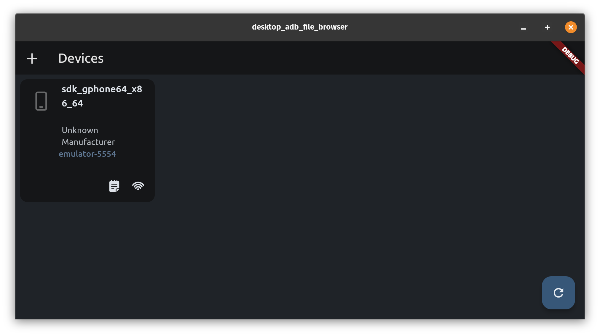
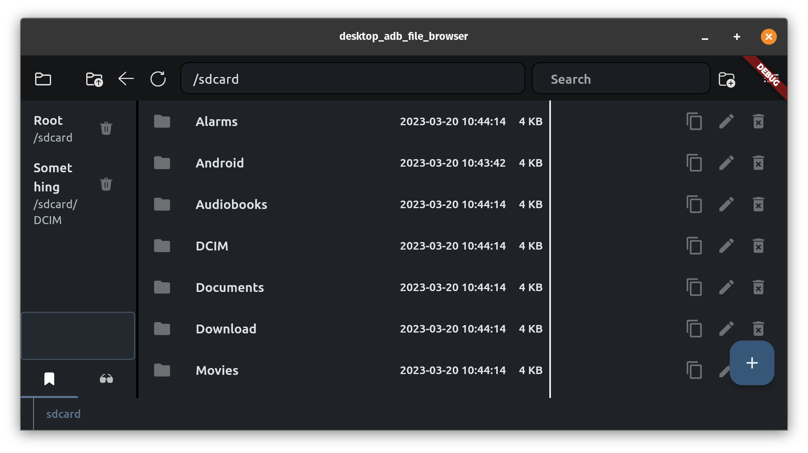

# Desktop ADB File Browser (DAB)

A project designed to replace the jank file manager SideQuest offers for Android devices. It emphasizes performance, navigation and UI design, though the latter I'm not terribly good at. (I'm sorry)

Focus is directed to ensuring a smooth and reliable experience, though some pages are deemed _less than desired quality_ such as logs, keyboard navigation or user action feedback.

Being Flutter, it works on Linux, Mac and Windows (though for now, limited to x64).
It uses `adb` under the hood and provides a mechanism to download if need be. 

## Screenshots:

Some features:
- Not limited to a single device connection
- Wireless ADB support
- Logcat (though janky)
- File management
  - Bookmarks
  - File watch (Host -> Android Device). No support for watching file modifications from Android to Host (yet)
  - Download
  - Upload
  - Drag and drop
  - Mouse button navigation (Windows only)

## Contributing:
Any Flutter supported IDE will likely work with this project out of the box, though I personally tend to use VS Code or less often Android Studio. Either is fine.

1. Ensure you have the [Flutter SDK installed](https://flutter.dev/).
2. Download libraries: `flutter pub get`
3. Run the project using your IDE run config, such as the provided VS Code run configs. You may also use `flutter run` as a CLI alternative
4. Commit your changes, branch and PR. Please try to keep your PR scoped into a single feature, UI design change(s) or refactor to minimize friction.

The contribution guidelines are fairly straightforward, just do what works best. If possible, provide a screenshot or GIF of any UI design change if applicable. I tend to be mostly a Windows developer though I often use Pop! OS too, which means testing Mac and Linux can be cumbersome for me at times. In other words, please be patient with me :)

I'll gladly appreciate any contribution <3
